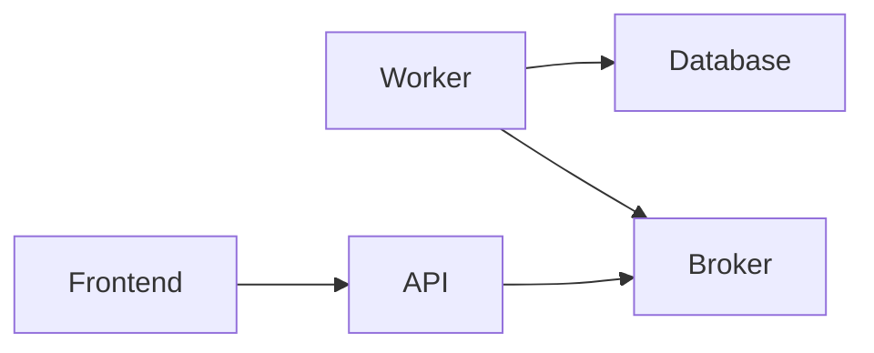

# TODO Challenge

Escrito com C#, .NET 6, Minimal APIs, AutoMapper, MassTransit, Fluent Validation, Serilog, Entity Framework, Vite, React, Postgres e Docker.

São 5 servicos principais: Frontend, API, Worker, RabbitMQ e Database.



### Database

O banco de dados é um Postgres. Escolhi este por ser um banco de dados relacional e por ser um dos mais utilizados no mercado.

### Broker

O broker é um RabbitMQ. Escolhi este por ser um dos brokers mais utilizados no mercado e por ser fácil de utilizar.

### Api

É uma API [ASP.NET](https://dotnet.microsoft.com/apps/aspnet) construida usando Minimal APIs, pela simplicidade do negócio/serviço.

- `backend/api/endpoints/todos.cs` - Lógica do endpoint relacionado aos Todos e sua comunicacao com o Broker
- `backend/api/program.ts` - Configuracao das dependencias e bootstrap da aplicacao

A ideia foi manter simplicidade, facilidade de extencao e manutencao se atendo aos requisitos de design.
Toda chamadas é criado enviado um Request ao Broker que devolve um Response.

### Worker

O Worker é um serviço que consome mensagens do Broker e realiza ações baseadas nelas.
Dividido em 2 HostedServices, um para responder as mensagens de leitura e outro de escrita.

### Frontend

O frontend é um projeto React com [Vite](https://vitejs.dev/). Escolhi o Vite por ser um bundler extremamente rápido e fácil de utilizar.

Coloquei o [Shadcn](https://ui.shadcn.com/) para facilitar a criação de componentes e o [SWR](https://swr.vercel.app/) por conta das features e simplicidade no uso.

- `frontend/src/main.tsx` - Entrypoint do projeto
- `frontend/src/components/todos.tsx` - Componente principal da aplicação. Nele fica cada uma das Todo e possui a lógica de adicionar, deletar e marcar como feita

## Como rodar

Abrindo o terminal na pasta raiz, o comando abaixo irá subir os 3 serviços.

```bash
docker-compose up -d --build
```

Após a subida apenas acessar no browser `http://localhost:8081`

