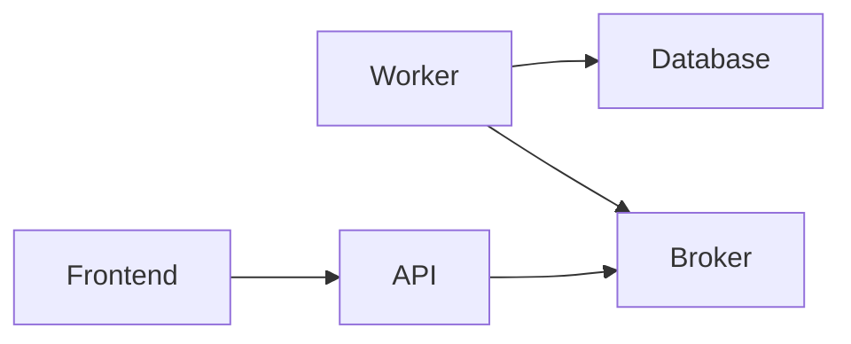

# TODO Challenge

Written with C#, .NET 6, Minimal APIs, AutoMapper, MassTransit, Fluent Validation, Serilog, Entity Framework, Vite, React, Postgres, and Docker.

There are 5 main services: Frontend, API, Worker, RabbitMQ, and Database.



### Database

The database is a [Postgres](https://www.postgresql.org/). I chose this because it is a relational database, very robust despite being small, and also because it is one of the most widely used.

### Broker

The broker is a [RabbitMQ](https://www.rabbitmq.com/). I chose this because it is one of the most widely used in the market and because it is a messaging broker.
### API

The API is an [ASP.NET](https://dotnet.microsoft.com/apps/aspnet) API built using Minimal APIs for the simplicity of the business/service.

- `backend/api/endpoints/todos.cs` - Logic for the Todos endpoint and its communication with the Broker
- `backend/api/program.ts` - Dependency configuration and application bootstrap

The idea was to maintain simplicity, ease of extension, and maintenance while adhering to design requirements.
Every call creates a Request sent to the Broker, which returns a Response.

### Worker

The Worker is a service that consumes messages from the Broker and performs actions based on them.
Divided into 2 HostedServices, one for handling read messages and another for handling write messages.
### Frontend

The frontend is a React project with [Vite](https://vitejs.dev/). I chose Vite because it is an extremely fast and easy-to-use bundler.

I used [Shadcn](https://ui.shadcn.com/) to facilitate component creation and [SWR](https://swr.vercel.app/) for its features and simplicity of use.

- `frontend/src/main.tsx` - Project entry point
- `frontend/src/components/todos.tsx` - Main component of the application. It contains each Todo item and handles the logic for adding, deleting, and marking as done.

## How to run

Open the terminal in the root folder and run the following command to start the 3 services.

```bash
docker-compose up -d --build
```

After the services are up, simply access `http://localhost:8081` in your browser.

